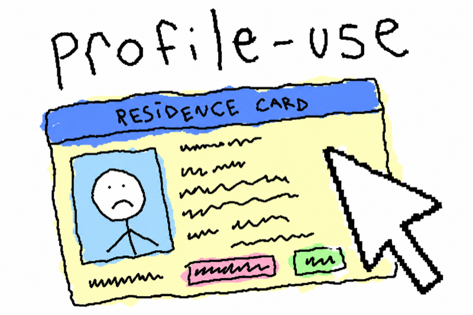
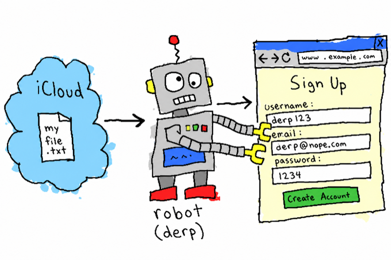
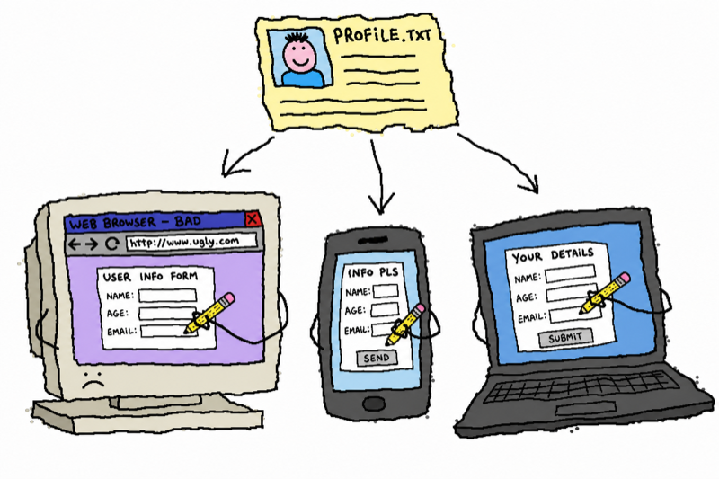

<p align="center">
  
</p>

# profile-use

**中文** | [English](README.md)

一份私有档案，填遍所有表单。这是一个 agent skill：用一份本地个人档案自动填写注册、开户、结账、银行、KYC、入职等各种表单——而你的个人数据永远不会进 Git 仓库、不会留在聊天记录里、不会上传到任何人的服务器。

它属于 `*-use` 家族（`iphone-use`、浏览器自动化、computer use）：那些 skill 负责操作设备，**profile-use 负责提供往表单里填的数据**。

## "我的数据会泄露吗？"

<p align="center">
  
</p>

这是用户最关心的问题，所以把整个模型摆在最前面：

| 你的数据 | 在哪里 | 不在哪里 |
| --- | --- | --- |
| 档案 JSON（姓名、地址、电话、银行、证件号） | 你自己的 iCloud Drive 或 `~/.config`，文件权限 600 | 不在本仓库，不在我们的云服务（根本没有），不在模型训练数据里 |
| 证件原图（在留卡、银行卡……） | 和档案放在一起，权限 600 | 不进 Git，不在 `/tmp` 里残留——skill 用完会自己清理 |
| 聊天 / 回复里展示的值 | 默认脱敏（`t***@example.com`、`********2590`） | 明文只在你明确要求时才出现在对话里 |

写死在 `SKILL.md` 里的硬规则：

1. **绝不编造数据。** 缺字段 → 问你，或留空。
2. **默认脱敏。** Agent 平时只看打码的值；明文只在敲进表单的那一刻读取。
3. **高敏字段闸门。** 支付卡、银行账户、政府证件、税号、生日：每次填写或展示前都单独向你确认。
4. **绝不自动提交。** 表单只在你看过脱敏摘要、明确批准后才提交。
5. **原件上传逐次确认。** 即使文字自动填写已经获批。
6. **域名校验。** 浏览器自动化填写前核实真实域名，遇到仿冒域名直接停。

这个公开仓库只包含代码、schema 和占位模板。`.gitignore` 挡住了 `*.profile.json`；明文个人数据永远不属于 Git——我们的不行，你的也不行。

## 它是做什么的

<p align="center">
  
</p>

你维护一份 `personal.profile.json`（还可以有 `work`、`family`、`jp` 等多份档案）。任何表单需要你的信息时，agent 把表单字段映射到档案的点路径，填上正确的值：

- **文字字段** —— 姓名、假名、生日、地址（支持 `address.jp.*` 这类国家变体）、电话、邮箱、邮编、银行、税号、发票抬头、偏好设置。
- **证件原图** —— 在留卡照片、个人番号卡、银行卡：作为附件和档案存在一起，KYC 表单要上传照片时按路径取用。
- **越用越全** —— 每次真实注册中遇到的新字段都会回存进档案，下一张表单更快。

## 配合你的自动化栈

<p align="center">
  
</p>

profile-use 是**数据层**。屏幕交给谁开都行：

| 驱动器 | 场景 |
| --- | --- |
| 浏览器自动化（Claude in Chrome、agent-browser、computer use） | 网站自动注册、结账、KYC 照片上传 |
| `iphone-use` | iOS 原生 App 内的注册引导流程 |
| 桌面自动化（computer use、cua-driver） | 桌面应用注册 |

流程永远一样：驱动器读表单 → profile-use 出值（明文只在填写瞬间出现）→ 高敏字段和最终提交等你确认。

## 安装

```bash
npx skills add leeguooooo/profile-use
```

或者用 GitHub URL：

```bash
npx skills add https://github.com/leeguooooo/profile-use
```

## 创建私有档案

```bash
python3 scripts/profile_use.py init --profile personal
python3 scripts/profile_use.py path --profile personal
python3 scripts/profile_use.py doctor --profile personal
```

默认优先使用 iCloud Drive（可用时）：

```text
~/Library/Mobile Documents/com~apple~CloudDocs/Agent Profiles/profile-use
```

脚本检查 iCloud Drive 根目录，首次写入时自动创建 `Agent Profiles/profile-use`。iCloud 不可用时回退到 `~/.config/profile-use`。

自定义位置：

```bash
export PROFILE_USE_DIR="/private/path/to/profile-use"
```

## 常用命令

```bash
python3 scripts/profile_use.py show --profile personal
python3 scripts/profile_use.py values --profile personal
python3 scripts/profile_use.py values --profile personal contact.email address.postal_code
python3 scripts/profile_use.py get --profile personal contact.email address.postal_code
python3 scripts/profile_use.py get --profile personal --reveal contact.email
python3 scripts/profile_use.py set --profile personal contact.email "me@example.com"
python3 scripts/profile_use.py set --profile personal preferences.marketing_opt_in false --json
python3 scripts/profile_use.py unset --profile personal preferences.marketing_opt_in
python3 scripts/profile_use.py list-fields --profile personal --filled
python3 scripts/profile_use.py check --profile personal
```

两种输出模式：

- **`values`** —— 明文值，用于往表单里填。不带字段时输出所有已填低/中敏字段的 `{点路径: 值}` 平铺映射（高敏字段除非点名或加 `--include-sensitive`，否则不出现）。
- **`show` / `get`** —— 默认脱敏，用于确认结构或向用户汇报。加 `--reveal` 看明文。

绝不要把脱敏值（`t***@example.com`）填进表单——填表一律用 `values`。

## 证件原图

给需要上传照片的表单用（KYC、工资、身份验证）：

```bash
python3 scripts/profile_use.py attach ~/Downloads/card.jpg --doc residence_card_front --label "在留カード 表面" --move
python3 scripts/profile_use.py attachments --profile personal
python3 scripts/profile_use.py attachment-path --doc residence_card_front
python3 scripts/profile_use.py detach --doc residence_card_front
```

附件存在档案旁边（`<档案目录>/attachments/<profile>/`，权限 600），随档案一起同步、永不进 Git；元数据（标签、来源、收录日期、sha256）记录在档案 JSON 的 `documents.<doc>` 下。

## 随时间补充信息

档案就该在真实注册中越用越全。遇到缺的可复用字段，用点路径补上：

```bash
python3 scripts/profile_use.py set --profile personal identity.name_kana "..."
python3 scripts/profile_use.py set --profile personal address.jp.prefecture "..."
python3 scripts/profile_use.py set --profile personal invoice.receipt_name "..."
```

国家特有或站点特有的字段用灵活的嵌套路径。不要保存一次性验证码、CAPTCHA 文本、临时链接、密码或会话令牌。

## 同步建议

日常档案用 iCloud Drive。银行卡、账户、密码、恢复码、政府证件交给密码管理器。GitHub 只放 skill 代码、schema、占位示例或加密备份。

永远不要提交明文档案数据。

## 从 personal-autofill 迁移

本项目原名 `personal-autofill`。老安装继续可用——GitHub 自动重定向仓库地址，脚本仍认旧环境变量 `PERSONAL_AUTOFILL_DIR`，新数据目录不存在时自动回退到旧的 `personal-autofill` 目录。想收敛到新名字：

```bash
# 1. 用新名字重装 skill
npx skills remove personal-autofill -g
npx skills add leeguooooo/profile-use -g

# 2. 重命名数据目录（可选——回退机制永久有效）
mv "$HOME/Library/Mobile Documents/com~apple~CloudDocs/Agent Profiles/personal-autofill" \
   "$HOME/Library/Mobile Documents/com~apple~CloudDocs/Agent Profiles/profile-use"

# 3. 如果导出过旧环境变量，换个名字
export PROFILE_USE_DIR="..."   # 原 PERSONAL_AUTOFILL_DIR
```

## 插图为什么长这样

它们就是按这个项目处理你数据的方式画出来的：本地、糙、但完全透明。
